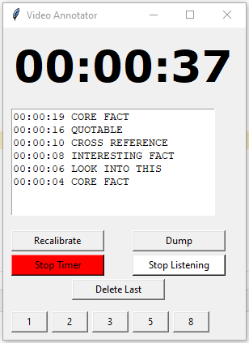

# What is this?
If you are doing research that requires reviewing large amounts of multimedia, it is often helpful to jot down specific timestamps in the video / audio to review later. Some audio recorders and video players have this feature, but it is not very customizable. It also requires a special software, which may not be compatible with your specific file type.

This simple python program separates the annotation program from the playback program. You can use any playback software you want. Then, you run this code `video_annotator.py`, which opens a graphic window. Play your video as usual, and the annotator will mimic the timestep of the video. Then, you can annotate timestamps. At the end, the annotatiosn are exported to a simple text file, which you can copy/paste into any database like Zotero. 

You can also use this during narrative interviews, or during rehearsal run-throughs. Anything that requires live annotation, this is your tool! 

Because the timer uses system time, it should not lag behind. The timer has been stress tested on a one-hour-long video, and it keeps in lock-step with the YouTube player. 

# Quick Start
Install `tkinter` (`tk` in pip) and `keyboard`. Then, run the program. You will see a window that contains a timestamp, a text box, and three buttons. 

The program listens for keystrokes anywhere, which means that you can have your cursor focused on the video. 

To start annotating, put the video at the start position (00:00) on your player. Press the space bar (which should play your video). The annotator timestamp should also start to count. At any time, you can pause the annotator using the space button, and jog it left and right by 10 seconds using the left and right arrow keys. The number of seconds can be easily set in the code.

To annotate, the number keys to mark points in the video. As it stands: 

- the "1" key marks CORE FACT
- the "2" key marks LOOK INTO THIS
- the "3" key marks INTERESTING FACT
- the "5" key marks CROSS REFERENCE
- the "8" key marks QUOTABLE

After you add a mark, another window will pop up. You can type additional annotations into this window. Press "X" or `esc` to save and close the additional annotations. If you don't type anything, then no additional text will be added in the report
The annotations can be easily changed in the code, if needed. 

Note that the 4 and 6 key is not used because it conflicts with the jogging, for some reason. 

At the very end, just close out of the window, and the annotations are automatically dumped to a text file found in the same directory as the `video_annotator.py` code.

# Advanced Features
There are five large buttons on the window. The first one, `Recalibrate`, allows you to enter a custom time into the timer using the command line interface.  A neat trick: press the "recalibrate" button on a round number on your video player but keep the video playing. Put this value into the recalibration; the timer will be running in the background and will add your number accordingly. This allows for live recalibration, and I found it personally super useful.

The second one, `Dump`, allows you to export the annotations to a text file without closing the window (good for backups)

The third one, `Start / Stop Timer`, allows you to start and stop the timestamp without using the space bar 

The fourth one, `Stop / Start Listening`, allows you to momentarily stop the key monitoring, if you're typing something. 

The fifth one, `Delete Last` allows you to remove the last tag, which is helpful if you've messed up. 

There are also smaller buttons that correspond to the individual marks. This is helpful if you want to use your mouse to annotate instead of hotkeys.

# Screenshot

